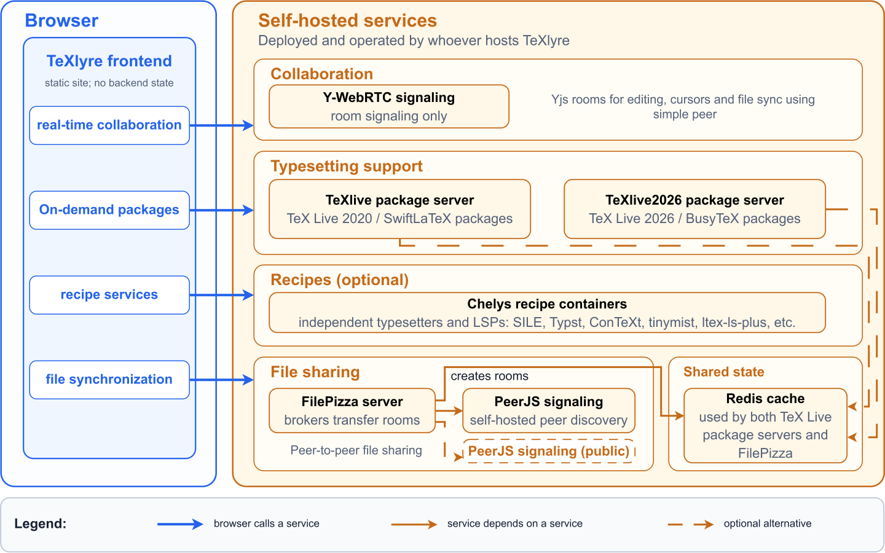

# texlyre-infrastructure

An omni-repo for deploying TeXlyre and its supporting services.



## Quick Start

1. Install dependencies:

```bash
npm install
```

2. Copy the `envfile.local` to `.env`:

```bash
cp envfile.local .env
```

3. **[OPTIONAL]** Modify the `RECIPES` in the `.env` file to include any optional Chelys recipes (run `npm run recipes:list-verbose` to view available recipes along with the provided options) e.g., add the SILE typesetter and ltex-ls-plus (grammartools) with:

```bash
RECIPES=sile,ltex-ls-plus?language=en-GB
```

4. Pull the pre-built images (TeXlyre services and Chelys recipes) and deploy all:

```bash
npm run recipes
npm run up:recipes
```

5. TeXlyre is available at `http://localhost:8082/texlyre/` with SILE as a typesetter alongside the WASM Typst and LaTeX, and grammar correction hints on opening `tex`, `bib`, `typst`, `md` and text files.


## Build from Source 

Clone with submodules so each buildable service is checked out at its pinned release:

```bash
git clone --recurse-submodules https://github.com/TeXlyre/texlyre-infrastructure.git
cd texlyre-infrastructure
```

For an existing clone:

```bash
git submodule update --init --recursive
```

Copy the local environment template. `.env` is gitignored, so deployment-specific
settings remain local:

```bash
cp envfile.local .env
```

Deploy the complete stack:

```bash
docker compose up -d --build
```

TeXlyre is then available at http://localhost:8082/texlyre/.

Each buildable service declares both a `build:` context and a published `image:` tag.
Use `--build` to compile from the pinned submodules, or pull the published images:

```bash
docker compose pull
docker compose up -d
```

The npm wrappers use `--remove-orphans`, which also removes services that were disabled
since the previous start:

```bash
npm install
npm start
npm run logs
npm run down
```

## Built-in Services

`SERVICES` controls the built-in Compose services. The supplied environment files use
`SERVICES=all`, so every service is enabled by default. Set it to `none` or a
comma-separated subset of:

```env
SERVICES=frontend,portainer,filepizza,ywebrtc,peerjs,texlive,texlive2026,redis
COMPOSE_PROFILES=${SERVICES:-all}
```

For example, this keeps the frontend, collaboration, file transfer, and original TeX Live
server while disabling Portainer and TeX Live 2026:

```env
SERVICES=frontend,filepizza,ywebrtc,peerjs,texlive
```

Traefik remains the routing core. Redis is activated automatically when `filepizza` or
`texlive2026` is selected, and can also be selected directly.

Frontend endpoint overrides are service-scoped. If a service is absent from `SERVICES`,
its corresponding setting is not added to TeXlyre userdata; the image's own default for
that setting remains untouched.

## Chelys Recipes

Set `RECIPES` to add selected Chelys recipe services alongside the built-in stack:

```env
RECIPES=sile,ltex-ls-plus?language=en-GB
```

Then generate and start the recipe Compose file:

```bash
npm run recipes
npm run up:recipes
```

Use `npm run recipes:list` to list available recipe IDs. Generated recipe services and
their TeXlyre userdata are removed when `RECIPES` is empty and `npm run recipes` is run.

## Frontend Configuration

The frontend image contains TeXlyre's own defaults. At container start,
`TEXLYRE_USERDATA_VARIANT` selects a deployment layer from
`frontend/userdata.overrides/`; enabled services add their own endpoint layers, generated
recipes add their configuration layer, and inline userdata is merged last.

Each layer contains only the keys it changes, so unrelated TeXlyre settings continue to
come from the frontend image. `${BASE_DOMAIN}`, `${PRODUCTION_DOMAIN}`, `${HTTP_PORT}` and
`${HTTPS_PORT}` are substituted from `.env`.

Set `TEXLYRE_USERDATA` to override any additional setting without adding a file:

```env
TEXLYRE_USERDATA={"settings":{"theme-variant":"atom_light","editor-font-size":"md"}}
```

See [frontend/userdata.overrides/README.md](frontend/userdata.overrides/README.md) for the
merge order and file naming.

## Service Access

With `SERVICES=all`, the local stack is available through Traefik on port 8082.

### Management

* **Traefik Dashboard**: http://traefik.localhost:8082
* **Portainer**: http://portainer.localhost:8082

### Applications

* **TeXlyre Frontend**: http://localhost:8082/texlyre/
* **FilePizza**: http://filepizza.localhost:8082
* **Y-WebRTC**: http://ywebrtc.localhost:8082
* **PeerJS**: http://peerjs.localhost:8082
* **TeX Live**: http://texlive.localhost:8082
* **TeX Live 2026**: http://texlive2026.localhost:8082

Only selected services are started and advertised to TeXlyre.

## TeX Live 2026 Server

`texlive2026-server` serves TeX Live 2026 files on demand for BusyTeX. It is enabled by
default with the other built-in services. Its `texmf-dist` tree is fetched into the
`texmf` named volume on first start and reused afterwards.

`TEXMF_URL` in `.env` points at the published tree. Set `TEXMF_ROOT` to an absolute path
instead to mount an existing tree and skip the download. Remove `texlive2026` from
`SERVICES` to disable both the server and its initializer without adding the BusyTeX
endpoint to frontend userdata. See [ADVANCED.md](ADVANCED.md) for storage details.

## Submodule Versions

`.gitmodules` declares the release each service is pinned to:

```properties
[submodule "services/y-webrtc-server"]
	path = services/y-webrtc-server
	url = https://github.com/TeXlyre/y-webrtc-server.git
	tag = v10.3.0
```

To change a version, edit its `tag` entry and run:

```bash
npm run sync
```

This checks out each declared tag, stages the resulting submodule commit, and rewrites the
matching `image:` tags in `docker-compose.yml`. `npm run sync:check` reports drift without
changing files.

For consumers, `git submodule update --init --recursive` restores the commits recorded by
the repository. `--remote` is intentionally not used because it follows branch tips rather
than the pinned releases.

## Publishing Images

`docker-compose.yml` is the source of truth for image versions. Every buildable service
has a literal `image:` tag and an `x-publish:` block:

```yaml
  y-webrtc-server:
    image: ghcr.io/texlyre/y-webrtc-server:10.3.0
    build:
      context: ./services/y-webrtc-server
    x-publish:
      platforms:
        - linux/amd64
        - linux/arm64
```

On push to `main`, `.github/workflows/publish-images.yml` builds the declared platforms,
pushes them by digest, and assembles the final GHCR manifest. Existing tags are skipped
unless the workflow is run manually with `force`.

## Management Commands

```bash
npm run submodules:status
npm run pull
npm run ps
npm run logs
npm run restart
npm run down
npm run down:volumes
```

`npm run down` enables every profile for the removal command, so it also removes services
that are no longer listed in the current `SERVICES` selection.

## Advanced Configuration

For network hosting, production deployment, custom ports, TeX Live storage, recipe
registry overrides, and image publishing details, see [ADVANCED.md](ADVANCED.md).

## Container Names

Depending on `SERVICES`, the deployment uses these container names:

* `${COMPOSE_PROJECT_NAME}-traefik`
* `${COMPOSE_PROJECT_NAME}-portainer`
* `${COMPOSE_PROJECT_NAME}-frontend`
* `${COMPOSE_PROJECT_NAME}-filepizza`
* `${COMPOSE_PROJECT_NAME}-ywebrtc`
* `${COMPOSE_PROJECT_NAME}-peerjs`
* `${COMPOSE_PROJECT_NAME}-texlive`
* `${COMPOSE_PROJECT_NAME}-texlive2026-texmf`
* `${COMPOSE_PROJECT_NAME}-texlive2026`
* `${COMPOSE_PROJECT_NAME}-redis`
