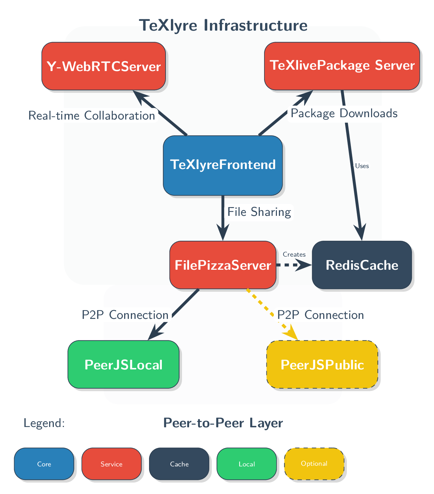

# texlyre-infrastructure

An omni-repo for deploying all TeXlyre servers locally



## Quick Start

Copy `envfile.local` to `.env`. That file is gitignored, so your local settings stay out of the repo:

```bash
cp envfile.local .env
```

Deploy using the images published by this repo:

```bash
git submodule deinit --all -f
git submodule update --init --recursive --remote
docker compose up -d
```

You can now access TeXlyre on http://localhost:8082/texlyre/

To build everything from the submodule sources instead of pulling, add `--build`:

```bash
docker compose up -d --build
```

## Frontend Configuration

The frontend image ships TeXlyre's own defaults and reads a deployment override at
container start. `TEXLYRE_USERDATA_VARIANT` in `.env` selects a file from
`frontend/userdata.overrides/`, which is deep-merged onto those defaults and written
to `userdata.local.json` inside the container.

Each override holds only the keys a deployment changes, so it never falls out of date
with TeXlyre's own settings. `${BASE_DOMAIN}`, `${PRODUCTION_DOMAIN}`, `${HTTP_PORT}`
and `${HTTPS_PORT}` are substituted from `.env`.

To change any other setting without adding a file, set `TEXLYRE_USERDATA` in `.env` to
a JSON object:

```env
TEXLYRE_USERDATA={"settings":{"theme-variant":"atom_light","editor-font-size":"md"}}
```

See [frontend/userdata.overrides/README.md](frontend/userdata.overrides/README.md) for details.

## Service Access

All services are accessible at http://localhost:8082 with subdomain routing:

### Management
* **Traefik Dashboard**: http://traefik.localhost:8082
* **Portainer**: http://portainer.localhost:8082

### Applications
* **TeXlyre Frontend**: http://localhost:8082/texlyre/
* **FilePizza**: http://filepizza.localhost:8082
* **Y-WebRTC**: http://ywebrtc.localhost:8082
* **PeerJS**: http://peerjs.localhost:8082
* **TeXlive**: http://texlive.localhost:8082
* **TeXLive 2026**: http://texlive2026.localhost:8082 (opt-in, see below)

## TeXLive 2026 Server

`texlive2026-server` serves TeX Live 2026 files on demand for busytex, from the
`texlive-server` directory of the [texlyre-busytex-build](https://github.com/TeXlyre/texlyre-busytex-build)
submodule. It needs a `texmf-dist` tree on the host, so it sits behind a compose
profile and does not start by default.

Set an absolute path in `.env` and enable the profile:

```bash
# .env
TEXMF_ROOT=/absolute/path/to/texlive-full/texmf-dist
```

```bash
docker compose --profile texlive2026 up -d
```

TeXlyre reaches it through the `latex-busytex-endpoint` setting, which the frontend
overrides already point at `texlive2026.${BASE_DOMAIN}`.

## Publishing Images

`docker-compose.yml` is the single source of truth for versions. Every buildable
service carries a literal `image:` tag and an `x-publish:` block:

```yaml
  y-webrtc-server:
    image: ghcr.io/texlyre/y-webrtc-server:1.0.0
    build:
      context: ./services/y-webrtc-server
    x-publish:
      platforms:
        - linux/amd64
        - linux/arm64
```

On push to `main`, `.github/workflows/publish-images.yml` turns those blocks into a
build matrix and pushes each image to GHCR, labelled with the submodule's origin URL
and commit. A tag that already exists is skipped, so releasing a new build means
bumping the tag in `docker-compose.yml`. Use the workflow's `force` input to
deliberately overwrite.

Renovate watches the submodules and opens a PR when a tracked branch moves; bump the
matching image tag in that PR.

## Management Commands

Update submodules to latest version:
```bash
git submodule update --remote --merge
```

Pull newly published images:
```bash
docker compose pull
```

Stop containers:
```bash
docker compose down
```

## Advanced Configuration

For network hosting, production deployment, custom ports, and SSL setup, see [ADVANCED.md](ADVANCED.md).

## Container Names

Services are deployed with the following container names:
* `${COMPOSE_PROJECT_NAME}-traefik`
* `${COMPOSE_PROJECT_NAME}-portainer`
* `${COMPOSE_PROJECT_NAME}-frontend`
* `${COMPOSE_PROJECT_NAME}-filepizza`
* `${COMPOSE_PROJECT_NAME}-ywebrtc`
* `${COMPOSE_PROJECT_NAME}-peerjs`
* `${COMPOSE_PROJECT_NAME}-texlive`
* `${COMPOSE_PROJECT_NAME}-texlive2026`
* `${COMPOSE_PROJECT_NAME}-redis`
