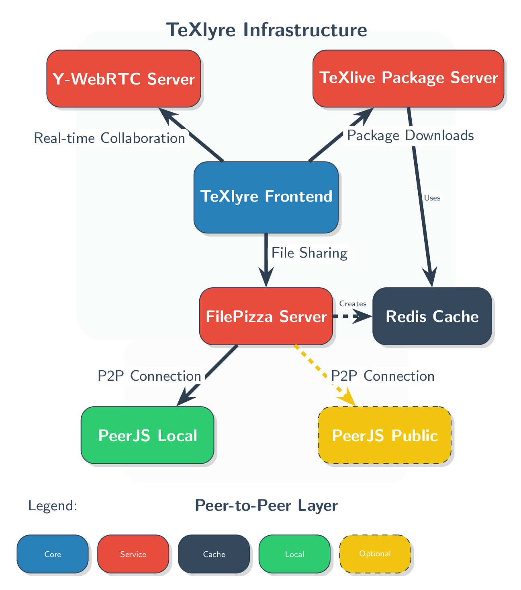

# texlyre-infrastructure

An omni-repo for deploying all TeXlyre servers locally



## Quick Start

Create your local environment file and deploy:

```bash
cp envfile.local .env
git submodule deinit --all -f
git submodule update --init --recursive --remote
docker compose up -d --build
```

## Service Access

All services are accessible at http://localhost:8082 with subdomain routing:

### Management
* **Traefik Dashboard**: http://traefik.localhost:8082
* **Portainer**: http://portainer.localhost:8082

### Applications
* **TeXlyre Frontend**: http://localhost:8082/texlyre/
* **FilePizza**: http://filepizza.localhost:8082
* **Y-WebRTC**: http://ywebrtc.localhost:8082
* **PeerJS**: http://peerjs.localhost:8082
* **TeXlive**: http://texlive.localhost:8082

## Management Commands

Update submodules to latest version:
```bash
git submodule update --remote --merge
```

Stop containers:
```bash
docker compose down
```

## Advanced Configuration

For network hosting, production deployment, custom ports, and SSL setup, see [ADVANCED.md](ADVANCED.md).

## Container Names

Services are deployed with the following container names:
* `${COMPOSE_PROJECT_NAME}-traefik`
* `${COMPOSE_PROJECT_NAME}-portainer`
* `${COMPOSE_PROJECT_NAME}-frontend`
* `${COMPOSE_PROJECT_NAME}-filepizza`
* `${COMPOSE_PROJECT_NAME}-ywebrtc`
* `${COMPOSE_PROJECT_NAME}-peerjs`
* `${COMPOSE_PROJECT_NAME}-texlive`
* `${COMPOSE_PROJECT_NAME}-redis`